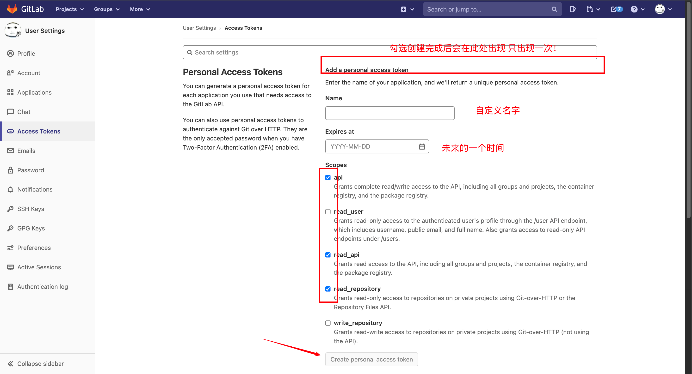
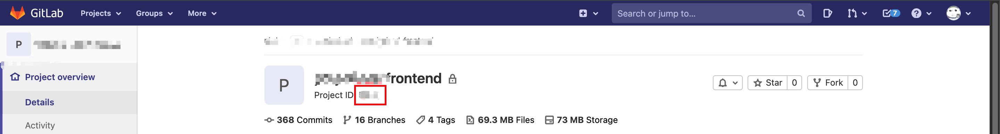
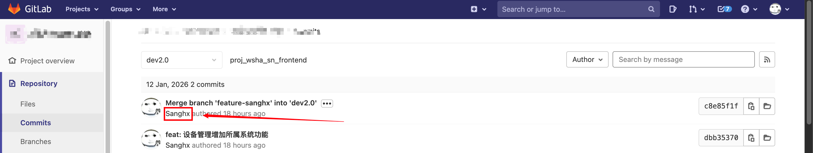
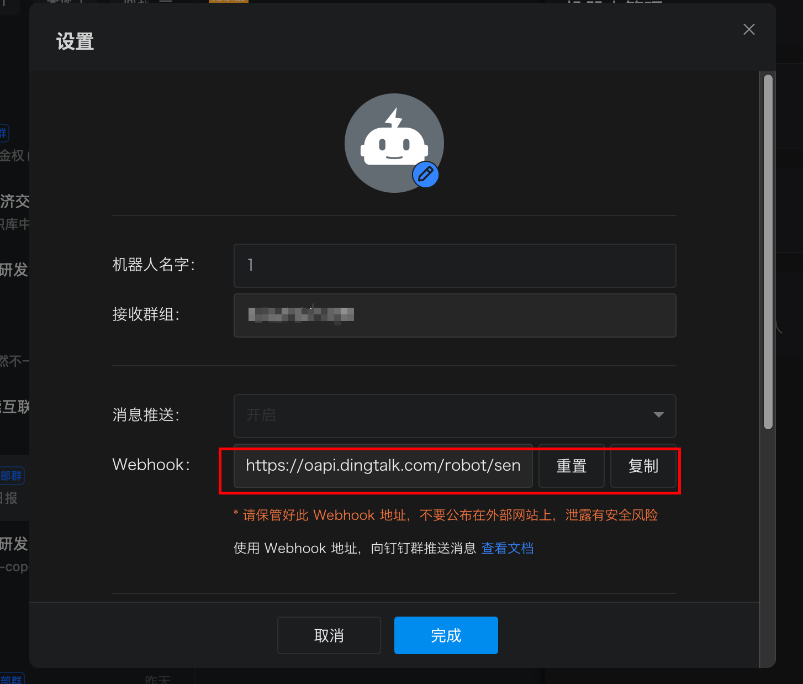
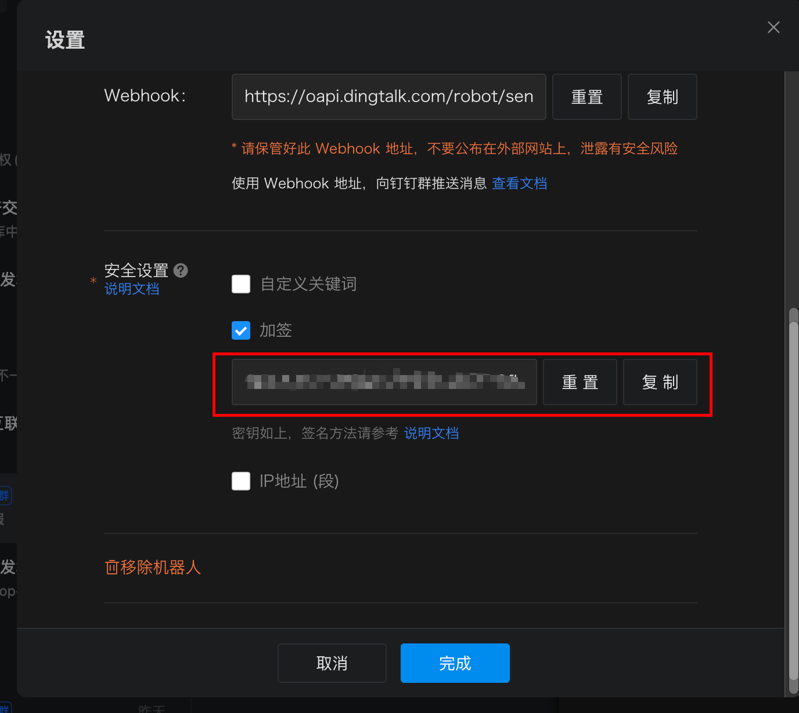

# GitLab → AI → 钉钉自动化日报系统

自动从 GitLab 获取今日提交记录,通过 AI 生成工作日报,并发送到钉钉群机器人。

```bash
npm install
```

### 1. 复制配置文件

```bash
生成配置文件示例
cp .env.example .env
```

### 2. 编辑 `.env` 文件

```bash
1.GitLab配置
GITLAB_URL 公司的gitlab地址
GITLAB_TOKEN gitlab账号的 Access Tokens 记住要勾选 api, read_api, read_repository
```



```
GITLAB_PROJECT_IDS 你经常提交的gitlab项目id 多个用逗号,隔开
```



```
GITLAB_AUTHOR_USERNAME 项目提交记录中
```



```

2.AI配置
个人建议去申请zhipu的apikey是免费的 模型(glm-4-flash)

3.钉钉配置
DINGTALK_WEBHOOK 群内机器人的webhook
```



```
DINGTALK_SECRET 群内机器人的安全设置选择加签生成的密钥
```



```

4.报告配置
REPORT_AUTHOR 名字
REPORT_TEAM 项目组名
```

# 发送日报到钉钉

npm start

# 模拟运行 (仅打印,不发送)

npm test

# 或

node index.js --dry-run

### 钉钉消息格式

```
📅 2026-01-08 工作日报

姓名: 张三
部门: 技术部

---

今日工作内容:
1.【修复】修复合成氨模块中 InputNumber 组件可输入多个前导 0 的问题,优化数值输入体验。
2.【新增】完成表单字段在不同模式下的动态展示逻辑调整。
3.【优化】重构表单配置代码,提升可维护性和可读性。

---

🤖 本日报由 AI 自动生成
```

## 🔧 高级配置

### 多人使用

为每个人创建独立的 `.env` 文件:

```bash
cp .env.example .env.zhangsan
cp .env.example .env.lisi
```

修改各自的配置:

```bash
# zhangsan
GITLAB_AUTHOR_USERNAME=zhangsan
REPORT_AUTHOR=张三

# lisi
GITLAB_AUTHOR_USERNAME=lisi
REPORT_AUTHOR=李四
```

执行时指定配置文件:

```bash
# 使用不同的环境变量文件
DOTENV_CONFIG_PATH=.env.zhangsan node index.js
DOTENV_CONFIG_PATH=.env.lisi node index.js
```

### 多项目管理

```bash
# 多个项目用逗号分隔
GITLAB_PROJECT_IDS=123,456,789
```
